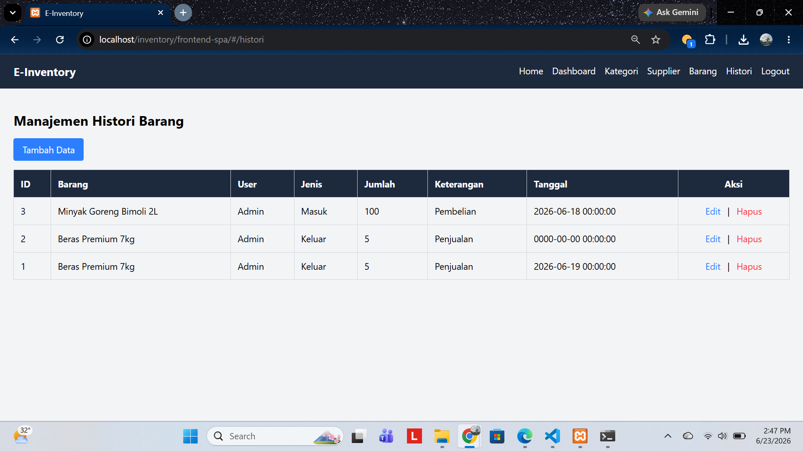

# UAS_Web2_312410382_Bagus_Aditya_Hermawan

# Judul: Sistem Manajemen Inventaris Barang (E-Inventory) Berbasis Vue.js dan CodeIgniter 4.

## Deskripsi Singkat: 
> E-Inventory merupakan sistem informasi berbasis web yang dirancang untuk membantu proses pengelolaan persediaan barang secara terintegrasi. Sistem ini menyediakan fitur manajemen data kategori, supplier, barang, serta pencatatan histori transaksi keluar dan masuk barang. Aplikasi dibangun menggunakan Vue.js dengan konsep Single Page Application (SPA) dan CodeIgniter 4 yang menyediakan layanan RESTfull API. Sistem menerapkan hak akses yang berbeda antara public dan admin, di mana pengunjung hanya dapat melihat halaman beranda (landing page), sedangkan admin dapat melakukan login untuk mengelola seluruh data inventaris. Dengan adanya sistem ini, proses pengelolaan stok menjadi lebih terstruktur, efisien, dan terintegrasi.

## Spesifikasi Teknologi Yang Digunakan
- Backend Engine: Codelingniter 4
- Frontend Engine: Vue.js 3, Vue Router
- UI: TailwindCSS
- Data Transfer: Library Axios dan MySQL

## Fitur Aplikasi
Backend: 
- Relasi Tabel
- RESTfull Endpoints
- Server-Side Security
- Penanganan CORS

Frontend:
- Sistem Login
- Client-Side Security
- Axios Interceptors
- TailwindCSS

Hak Akses
- Pengunjung: halaman beranda
- Administrator: Mengelola data master dan aktivitas logout.

## Dokumentasi Database dan Uji Coba
Skema relasi tabel databse
##### .

Uji tembak API gagal (error 401)
##### .

## Dokumentasi Antarimuka Aplikasi (UI)
### 1. Halaman login
##### .

### 2. Halaman Home dan dashboard admin
##### .

### 3. Halaman Home pengunjung
##### .
### 4. Form modal
Modal tambah:
- Barang dan Stok
##### .
- Supplier
##### .
- Histori
##### .
- Kategori
##### .

Modal Edit:
- Barang dan Stok
##### .
- Supplier
##### .
- Histori
##### .
- Kategori
##### .

### 5. Tabel data
- Barang dan Stok
##### .
- Supplier
##### .
- Histori
##### .
- Kategori
##### .


## Petunjuk Instalasi — E-Inventory (Backend & Frontend)

### Kebutuhan Sistem

- **XAMPP** (Apache + MySQL + PHP)
- **Browser modern** (Chrome/Edge/Firefox)
- Tidak diperlukan Node.js atau Composer — backend (CodeIgniter 4) dan frontend (Vue 3 via CDN) berjalan langsung tanpa proses build.

---

#### 1. Menyiapkan Database

1. Buka **XAMPP Control Panel**, jalankan **Apache** dan **MySQL**.
2. Buka `http://localhost/phpmyadmin`.
3. Buat database baru bernama `db_inventory`.
4. Import file SQL struktur tabel (`kategori`, `barang`, `supplier`, `histori_barang`, `users`) ke database tersebut melalui menu **Import**.
5. (Opsional) Jalankan query untuk menambahkan akun admin awal:
   ```sql
   INSERT INTO users (email, password, token)
   VALUES (
       'admin@inventory.com',
       '$2b$10$PRXHkS/oAzZrJibx93Dgb.24kdFOCzwfOXIcFJpfrqQbb/iK.kkuu',
       NULL
   );
   ```
   *(password untuk akun ini: `admin123`)*

---

### 2. Menjalankan Backend (CodeIgniter 4)

1. Salin folder project backend ke dalam folder `htdocs` XAMPP, misalnya:
   ```
   C:\xampp\htdocs\inventory\backend-api
   ```
2. Buka file `.env` di folder backend, sesuaikan koneksi database:
   ```
   CI_ENVIRONMENT = development

   database.default.hostname = localhost
   database.default.database = db_inventory
   database.default.username = root
   database.default.password =
   database.default.DBDriver = MySQLi
   ```
3. Backend dapat langsung diakses melalui Apache, contoh:
   ```
   http://localhost:8080/
   ```
   *(sesuaikan port Apache di `httpd-xampp.conf` / `httpd.conf` jika belum menggunakan port 8080)*
4. Uji backend berjalan dengan membuka:
   ```
   http://localhost:8080/api/dashboard-summary
   ```
   Jika muncul data JSON, backend sudah berjalan dengan benar.

---

### 3. Menjalankan Frontend (Vue 3 via CDN)

1. Salin folder project frontend ke dalam folder `htdocs` XAMPP, misalnya:
   ```
   C:\xampp\htdocs\inventory\frontend-spa
   ```
2. Pastikan `apiUrl` di file `app.js` frontend menunjuk ke alamat backend yang benar:
   ```javascript
   const apiUrl = 'http://localhost:8080';
   ```
3. Akses frontend melalui browser:
   ```
   http://localhost/inventory/frontend-spa/
   ```

---

### 4. Login ke Sistem

Gunakan akun admin yang sudah dibuat pada langkah 1:

| Email | Password |
|---|---|
| `admin@inventory.com` | `admin123` |

---

